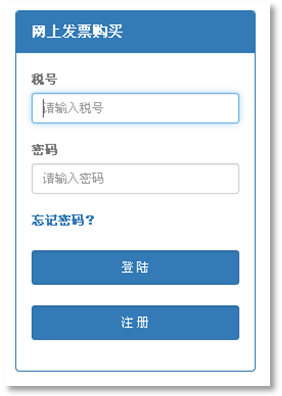
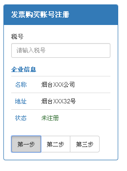
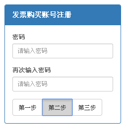
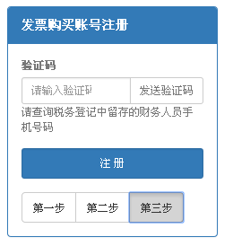
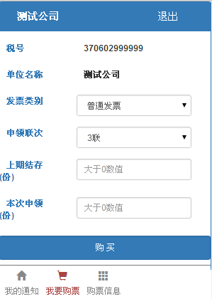
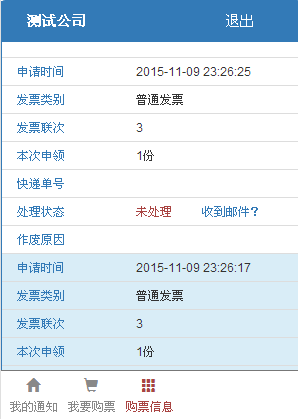

##微信购票免排队

###一、登记

纳税人需要到办税服务厅登记微信购票基本信息，包括税号、纳税人名称、企业联系人身份证号及手机号码、存取方式（邮寄表示通过快递发送,寄存表示纳税人来办税服务厅自取）。

    如果手机为移动用户，需要编辑短信1111到106573050606，待收到提示短信“已加入白名单”即可。

###二、注册

1、关注【烟台国税】微信公众号，点击右下角菜单【在线购票】，再点击右上角的【请登录】，进入登录注册页面：

 
点击注册按钮

2、输入企业的税号，系统会自动带出企业第一步登记的基本信息以及有无注册（如果没有带出企业信息，请检查税号或者是否已到办税服务厅登记基本信息）
 

3、输入注册的密码（不能为空、两次输入需一致，为确保安全性请尽量提高密码的复杂性）

 
4、单击发送验证码按钮，系统会将验证码发送到税务登记中留存的财务人员手机上，注意查收并填写（移动号码请确保已经添加白名单，请看第一步登记）

  
5、点击注册。

###三、登陆

在登陆注册页面输入注册时使用的税号和注册的密码，点击登陆即可。

 
###四、购票
 
点击底部的【我要购票】菜单，按要求填写表格，点击购买即可

###五、查看购票信息
 
点击底部的【购票信息】菜单，查看微信申请的处理状态：

如果是邮寄状态，请在收到邮寄的发票后，点击“收到邮件？”的链接向烟台市国税局发送确认收到邮件的消息；

如果是寄存状态，请纳税人自行到办税服务厅领取；

如果是未通过审核状态，请查看作废原因。

